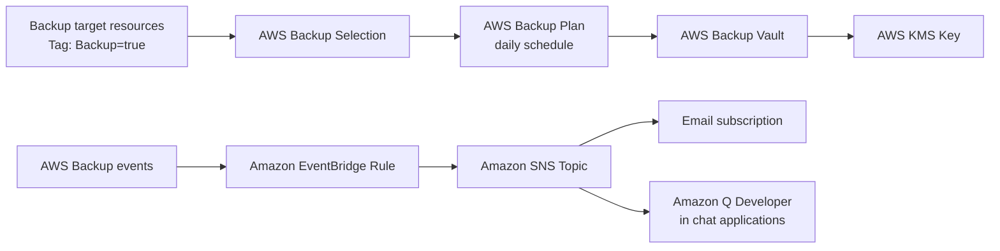

# aws-backup-ops-baseline-poc

AWS Backup を利用したバックアップ運用基盤を CloudFormation で作成する PoC リポジトリです。

タグベースでバックアップ対象を選択し、Backup Vault、Backup Plan、Backup Selection、KMS キー、AWS Backup 用 IAM Role、失敗通知用の EventBridge Rule と SNS Topic を作成します。

<br>

## 概要

このリポジトリでは、運用現場でよく利用する「対象リソースにタグを付けてバックアップ対象にする」構成を整理しています。

バックアップの取得だけでなく、保持期間、暗号化、通知、復旧確認の観点も含めて、後から説明しやすいバックアップ運用基盤としてまとめています。

<br>

## リポジトリの目的

- AWS Backup の基本構成を CloudFormation で再現できる形にする
- バックアップ対象をタグで管理する運用を整理する
- バックアップ失敗時の通知経路を複数パターンで説明できるようにする
- 復旧確認、保持期間、Vault Lock など運用上の考慮点を整理する

<br>

## アーキテクチャ



通知の詳細は [docs/notifications.md](docs/notifications.md) に整理しています。

<br>

## 作成される主な AWS リソース

| リソース | 用途 |
| --- | --- |
| AWS Backup Vault | 復旧ポイントを保管するバックアップ保管先 |
| AWS Backup Plan | バックアップスケジュール、開始ウィンドウ、完了ウィンドウ、保持期間を定義 |
| AWS Backup Selection | 指定タグが付与されたリソースをバックアップ対象に選択 |
| AWS KMS Key | Backup Vault の暗号化キー |
| IAM Role | AWS Backup が対象リソースをバックアップするためのサービスロール |
| Amazon SNS Topic | バックアップ失敗通知の通知先 |
| Amazon EventBridge Rule | AWS Backup の失敗系イベントを検知して SNS に連携 |

<br>

## CloudFormation テンプレート

| テンプレート | 内容 |
| --- | --- |
| [templates/aws-backup-ops-baseline.yaml](templates/aws-backup-ops-baseline.yaml) | AWS Backup のバックアップ運用基盤を作成 |

<br>

## パラメータファイル

パラメータファイルのサンプルは以下に格納しています。

| ファイル | 内容 |
| --- | --- |
| [parameters/aws-backup-ops-baseline.example.json](parameters/aws-backup-ops-baseline.example.json) | サンプルパラメータ |

実際にデプロイする場合は、サンプルファイルをコピーして使用します。

```bash
cp parameters/aws-backup-ops-baseline.example.json parameters/aws-backup-ops-baseline.json
```

`parameters/aws-backup-ops-baseline.json` には、自分の環境に合わせた値を設定します。

<br>

## パラメータ

| パラメータ | デフォルト | 説明 |
| --- | --- | --- |
| `ProjectName` | `aws-backup-ops-baseline-poc` | リソース名の接頭辞 |
| `EnvironmentName` | `poc` | 環境名 |
| `BackupScheduleExpression` | `cron(0 3 * * ? *)` | バックアップ実行スケジュール |
| `BackupScheduleTimezone` | `Asia/Tokyo` | スケジュールのタイムゾーン |
| `BackupRetentionDays` | `35` | 復旧ポイントの保持日数 |
| `BackupStartWindowMinutes` | `60` | 予定時刻からバックアップ開始までの猶予時間 |
| `BackupCompletionWindowMinutes` | `360` | バックアップ完了までの上限時間 |
| `EnableContinuousBackup` | `false` | 対応リソースで継続的バックアップを有効にするか |
| `BackupTargetTagKey` | `Backup` | バックアップ対象を選択するタグキー |
| `BackupTargetTagValue` | `true` | バックアップ対象を選択するタグ値 |
| `BackupSkipTagKey` | `BackupSkip` | バックアップ対象から明示的に除外するタグキー |
| `BackupSkipTagValue` | `true` | バックアップ対象から明示的に除外するタグ値 |
| `NotificationEmail` | 空 | SNS のメール通知先 |
| `CreateEmailSubscription` | `false` | SNS メール購読を作成するか |
| `EnableEventBridgeFailureRule` | `true` | 失敗系イベントを EventBridge で通知するか |
| `VaultLockMode` | `none` | Vault Lock の利用有無とモード |
| `VaultLockMinRetentionDays` | `7` | Vault Lock の最小保持日数 |
| `VaultLockMaxRetentionDays` | `365` | Vault Lock の最大保持日数 |
| `VaultLockChangeableForDays` | `3` | Compliance mode の変更可能期間 |

`VaultLockMode` を `compliance` にすると、猶予期間経過後に Vault Lock を変更・削除できなくなります。検証時は `none` または `governance` を推奨します。

<br>

## ディレクトリ構成

```text
.
├── README.md
├── docs
│   ├── architecture.md
│   ├── notifications.md
│   ├── operations.md
│   └── restore-guide.md
├── parameters
│   └── aws-backup-ops-baseline.example.json
└── templates
    └── aws-backup-ops-baseline.yaml
```

<br>

## 前提条件

- AWS CLI が利用できること
- CloudFormation スタックを作成できる IAM 権限があること
- AWS Backup、IAM、KMS、SNS、EventBridge を作成できる権限があること
- バックアップ対象リソースにタグを付与できること

<br>

## デプロイ・運用方法

### パラメータ準備

```bash
cp parameters/aws-backup-ops-baseline.example.json parameters/aws-backup-ops-baseline.json
```

メール通知を利用する場合は、`NotificationEmail` と `CreateEmailSubscription` を変更します。

```json
{
  "ParameterKey": "NotificationEmail",
  "ParameterValue": "<YOUR_NOTIFICATION_EMAIL>"
}
```

### テンプレート検証

```bash
aws cloudformation validate-template \
  --template-body file://templates/aws-backup-ops-baseline.yaml
```

### スタック作成

```bash
aws cloudformation create-stack \
  --stack-name aws-backup-ops-baseline-poc \
  --template-body file://templates/aws-backup-ops-baseline.yaml \
  --parameters file://parameters/aws-backup-ops-baseline.json \
  --capabilities CAPABILITY_NAMED_IAM
```

### バックアップ対象のタグ付け

バックアップ対象に以下のタグを付与します。

| キー | 値 |
| --- | --- |
| `Backup` | `true` |

タグを付与したリソースは、次回のバックアップスケジュールから AWS Backup の対象になります。

一時的にバックアップ対象から除外したい場合は、以下のタグを追加します。

| キー | 値 |
| --- | --- |
| `BackupSkip` | `true` |

この構成では、`Backup=true` が付いていても `BackupSkip=true` が付いているリソースはバックアップ対象から除外します。

### 通知確認

`CreateEmailSubscription` を `true` にした場合、指定メールアドレスに SNS 購読確認メールが届きます。

通知を有効にするには、メール内の Confirm subscription を承認します。

### 削除

```bash
aws cloudformation delete-stack \
  --stack-name aws-backup-ops-baseline-poc
```

Backup Vault に復旧ポイントが残っている場合、Backup Vault は削除できません。削除前に復旧ポイントの保持期間、Vault Lock、手動削除可否を確認してください。

<br>

## 関連ドキュメント

| ドキュメント | 内容 |
| --- | --- |
| [docs/architecture.md](docs/architecture.md) | 構成、作成リソース、設計方針 |
| [docs/notifications.md](docs/notifications.md) | バックアップ通知方式 |
| [docs/operations.md](docs/operations.md) | 運用時の確認ポイント |
| [docs/restore-guide.md](docs/restore-guide.md) | 復旧確認手順 |

<br>

## 参考

- [Backup plans - AWS Backup](https://docs.aws.amazon.com/aws-backup/latest/devguide/about-backup-plans.html)
- [Monitoring AWS Backup events using Amazon EventBridge](https://docs.aws.amazon.com/aws-backup/latest/devguide/eventbridge.html)
- [Notification options with AWS Backup](https://docs.aws.amazon.com/aws-backup/latest/devguide/backup-notifications.html)
- [AWS Backup Vault Lock](https://docs.aws.amazon.com/aws-backup/latest/devguide/vault-lock.html)
