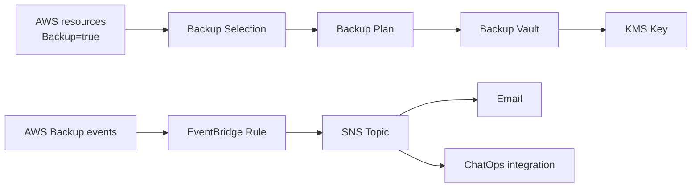

# アーキテクチャ

## 概要

この構成では、AWS Backup を利用してタグベースのバックアップ運用基盤を作成します。

バックアップ対象をテンプレート内で個別指定するのではなく、対象リソースにタグを付けることでバックアップ対象に含めます。

 

## 作成する構成

 

## 作成されるリソース

| リソース | 内容 |
| --- | --- |
| Backup Vault | 復旧ポイントを保管する論理コンテナ |
| Backup Plan | 日次バックアップ、保持期間、開始・完了ウィンドウを定義 |
| Backup Selection | `Backup=true` などのタグで対象リソースを選択 |
| KMS Key | Backup Vault の暗号化に使用 |
| IAM Role | AWS Backup が対象リソースをバックアップ・復元するために使用 |
| SNS Topic | 通知連携の中継先 |
| EventBridge Rule | AWS Backup の失敗系イベントを検知 |

 

## タグベース選択

バックアップ対象は、以下のようなタグで管理します。

| キー | 値 |
| --- | --- |
| `Backup` | `true` |

タグベースにすることで、テンプレートを更新せずにバックアップ対象を追加・除外できます。

本番運用では、バックアップ対象にするリソース種別、対象外にする条件、タグ付与の責任者を運用ルールとして明確にします。

 

## 保持期間

デフォルトでは、復旧ポイントを 35 日保持します。

保持期間は業務要件、監査要件、コスト、復旧要件に合わせて変更します。

 

## Vault Lock

Vault Lock はバックアップ削除耐性を高めるための機能です。

このテンプレートでは、検証しやすいように `VaultLockMode` のデフォルトを `none` にしています。

| モード | 内容 |
| --- | --- |
| `none` | Vault Lock を作成しない |
| `governance` | 権限を持つ管理者はロック解除可能 |
| `compliance` | 猶予期間経過後はロック解除不可 |

`compliance` は強力ですが、誤設定すると復旧ポイントやVaultを削除できなくなるため、事前検証を十分に行います。

 

## 通知設計

テンプレートでは、AWS Backup の失敗系イベントを EventBridge で検知し、SNS Topic に連携します。

SNS Topic からメール通知、Amazon Q Developer in chat applications、Lambda による外部サービス連携などへ拡張できます。
